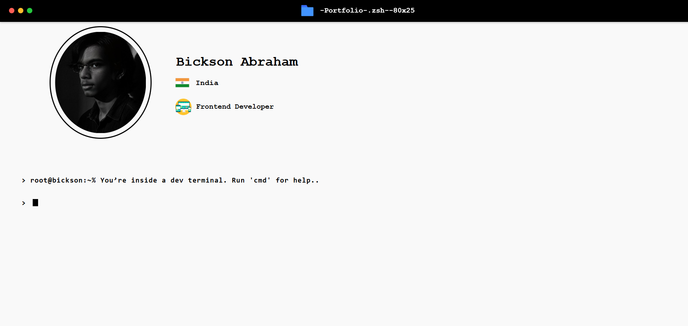

# Terminal Portfolio - Bickson Abraham

A web-based terminal-style developer portfolio where users can interact using commands like `ls`, `cat`, `clear`, and `cmd` to explore different sections such as About, Education, Projects, Skills, and Socials. Designed with React.

## 🚀 Live Demo

[View Live Project](https://your-live-link.com)

## 📸 Preview



## 🛠️ Built With

- React.js
- HTML5, CSS3
- Custom CSS styling (Responsive)
- JavaScript
- Modular Components

## 🧠 Features

- **Terminal-like interface:** Simulates a developer shell for navigation.
- **Interactive commands:** Users can type commands to display specific content.
- **Dynamic content rendering:** Displays profile, skills, social links, and project demos.
- **Responsive design:** Works well on both desktop and mobile devices.
- **Auto-scroll and focus management:** Input auto-focuses and scrolls on command execution.

## ✨ Available Commands

| Command            | Description                           |
|--------------------|---------------------------------------|
| `ls`               | Lists available files (sections)      |
| `cat about.txt`    | Displays the About section            |
| `cat education.txt`| Shows educational background          |
| `cat skill.txt`    | Shows programming skills              |
| `cat projects.txt` | Lists project demos and code links    |
| `cat social.txt`   | Lists social media links              |
| `cmd`              | Lists all available commands          |
| `clear`            | Clears the terminal screen            |

## 📂 Folder Structure

```
src/
├── assets/              # Images and icons
├── Components/
│   ├── Page.jsx         # Main terminal controller
│   ├── Cat.jsx          # Displays content like about, projects, etc.
│   ├── Ls.jsx           # Lists directories or commands
│   ├── NewLine.jsx      # Renders command input and display
│   └── Profiles.jsx     # Displays personal profile info
├── style.css            # Terminal styling
└── profile.css          # Profile card styling
```


## 📦 Installation

```bash
git clone https://github.com/Bicksona/Terminal-Portfolio.git
cd Terminal-Portfolio
npm install
npm start
```

## 📄 License

This project is open source and available under the [MIT License](LICENSE).
